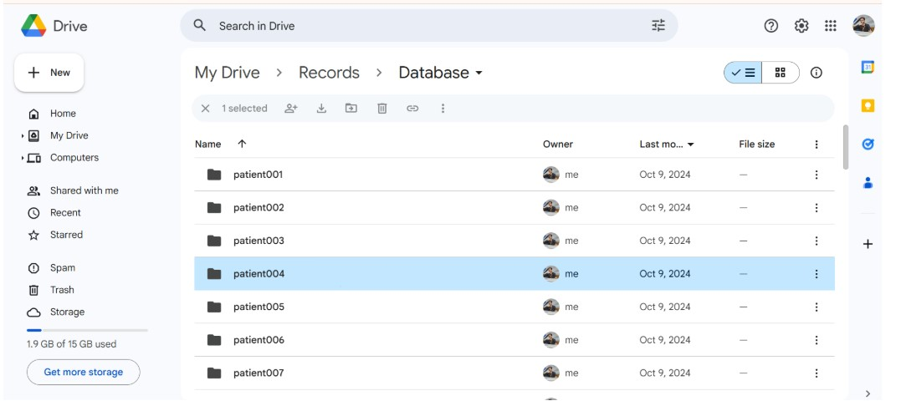
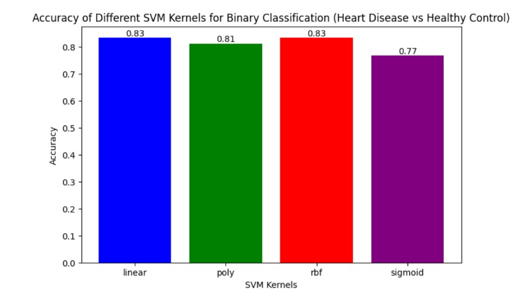
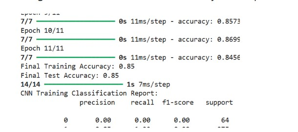

# Heart Disease Prediction using Machine Learning

A machine learning pipeline for detecting **heart disease from ECG signals** using the **PTB Diagnostic ECG Database** provided by PhysioNet.

This project demonstrates the full machine learning workflow including **ECG signal extraction, feature engineering, classical machine learning models, and deep learning approaches** for medical data classification.

---

## Project Overview

This project develops a machine learning framework to detect **heart disease from ECG signals** using the PTB Diagnostic ECG dataset.

The workflow includes:

- ECG signal extraction  
- Feature engineering  
- Machine learning classification using SVM  
- Deep learning using CNN to improve performance  

The final model achieves **~85% accuracy** for myocardial infarction detection.

---

## Dataset

The dataset used in this project is the **PTB Diagnostic ECG Database** from PhysioNet.

Dataset Link  
https://physionet.org/content/ptbdb/1.0.0/

### Dataset Details

- **Total Records:** 549 ECG recordings  
- **Patients:** 290  
- **Signal Type:** 12-lead ECG signals  
- **Sampling Frequency:** 1000 Hz  

### ECG Leads

I, II, III, aVL, aVR, aVF, V1 – V6

### File Types

| File Type | Description |
|-----------|-------------|
| `.dat` | Raw ECG signal data |
| `.hea` | Header file containing metadata |
| `.atr` | Annotation files with signal markers |

---

## Project Workflow

```
Raw ECG Data
    │
    ▼
Signal Processing
    │
    ▼
Feature Extraction
    │
    ▼
Machine Learning (SVM)
    │
    ▼
Deep Learning (CNN)
    │
    ▼
Heart Disease Classification
```


---

# Phase 1 – Reading Raw ECG Data

In the first phase, raw ECG signals were extracted from `.dat` files using Python.

### Steps

1. Download PTB dataset from PhysioNet  
2. Upload dataset folder to **Google Drive**  
3. Read ECG signals using Python libraries  
4. Visualize ECG signals for individual patients  

### Dataset Folder Uploaded to Google Drive



Code  
https://github.com/magantidatta/VLSI/blob/main/Machine%20Learning/Heart%20Disease%20Prediction%20/Codes/Project%20Phase%201.ipynb

---

# Phase 2 – Signal Processing and Feature Extraction

In this phase:

- ECG signals were plotted for **all 549 records**
- Signal coordinates were extracted
- Patient metadata was processed
- Heart related features were extracted

Generated files:

| File | Description |
|-----|-------------|
| `heart_disease_features.csv` | Extracted ECG features |
| `patient_details.csv` | Patient metadata |

### ECG Signal Processing Output


Extracted features include:

- RR Interval
- QRS Duration
- Signal Entropy
- Statistical ECG characteristics

Feature File  
https://github.com/Shanmukha190602/Heart-Disease-Prediction-using-Machine-Learning/blob/main/heart_disease_features.csv

Patient Details  
https://github.com/Shanmukha190602/Heart-Disease-Prediction-using-Machine-Learning/blob/main/patient_details.csv

Code  
https://github.com/magantidatta/VLSI/blob/main/Machine%20Learning/Heart%20Disease%20Prediction%20/Codes/Project%20Phase%202.ipynb

---

# Phase 3 – Machine Learning Classification (SVM)

After feature extraction, classification was performed using **Support Vector Machine (SVM)**.

### Binary Classification Setup

| Label | Meaning |
|------|--------|
| 0 | Healthy |
| 1 | Myocardial Infarction |

### Kernels Evaluated

- Linear  
- Polynomial  
- RBF  
- Sigmoid  

Best performance obtained with:

- **Linear Kernel**
- **RBF Kernel**

Accuracy achieved:

**83%**

### SVM Accuracy Comparison



Code  
https://github.com/magantidatta/VLSI/blob/main/Machine%20Learning/Heart%20Disease%20Prediction%20/Codes/Project%20Phase%203.ipynb

Evaluation metrics used:

- Confusion Matrix
- ROC Curve
- Accuracy

---

# Phase 4 – Deep Learning using CNN

To improve the classification accuracy, a **Convolutional Neural Network (CNN)** model was implemented.

CNN was chosen because it can:

- Detect complex feature relationships automatically
- Learn hierarchical patterns from data
- Handle structured signal data effectively
- Reduce dimensionality through convolution filters
- Prevent overfitting using dropout layers

### Model Architecture

- Convolution Layers  
- Dense Layers  
- Dropout Regularization  

### Results

| Model | Accuracy |
|------|---------|
| SVM | 83% |
| CNN | **~85%** |

The CNN model improved classification performance compared to classical machine learning models.

### CNN Model Performance



Code  
https://github.com/magantidatta/VLSI/blob/main/Machine%20Learning/Heart%20Disease%20Prediction%20/Codes/Project%20Final%20Phase.ipynb

---

# Technologies Used

- Python  
- Scikit-learn  
- TensorFlow / Keras  
- NumPy  
- SciPy  
- Pandas  
- WFDB  
- Google Colab  
- Jupyter Notebook  

---

# Repository Structure


```
Heart-Disease-Prediction/
├── Codes/
│   ├── Project Phase 1.ipynb
│   ├── Project Phase 2.ipynb
│   ├── Project Phase 3.ipynb
│   └── Project Final Phase.ipynb
├── heart_disease_features.csv
├── patient_details.csv
└── README.md
```


---

# Key Learning Outcomes

- ECG signal processing  
- Biomedical data feature engineering  
- Machine learning classification using SVM  
- Deep learning using CNN  
- Medical dataset analysis  
- Model evaluation using ROC curves and accuracy metrics  

---
## Future Work

- Apply advanced deep learning models such as LSTM or Transformers for ECG sequence analysis
- Perform hyperparameter tuning to improve CNN performance
- Extend the model to detect multiple cardiac conditions
- Deploy the model as a real-time health monitoring application

---
# Author

**Maganti Shanmukha Sri Datta**

GitHub  
https://github.com/magantidatta

LinkedIn  
https://www.linkedin.com/in/maganti-shanmukha-sri-datta-72a408240/
